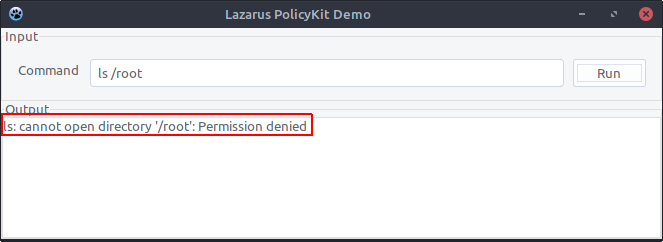
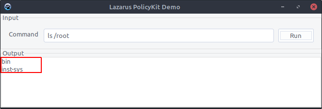

# LazPolKit
LazPolKit is an example Lazarus GUI application to demonstrate how to run a Lazarus application on GNU/Linux with administrative rights. The application makes use of [PolicyKit](https://www.freedesktop.org/wiki/Software/polkit/) to invoke a password dialog upon startup for obtaining administrative privileges. 

PolicyKit (or PolKit) is a component for controlling system-wide privileges in Unix-like operating systems. It is installed by default on modern GNU/Linux distributions.

Using this example application as a reference, you can easily add PolicyKit functionality to your own Lazarus application in order to obtain administrative privileges.

## Prerequisites

The [Lazarus IDE](https://www.lazarus-ide.org/) was used to develop LazPolKit and is needed to install LazPolKit. Follow [the instructions below](#lazarus) to install Lazarus.

## Installation

Assuming that Lazarus in installed, you can build LazPolKit from the terminal using the following command:

**`make clean all`**

After successfully building LazPolKit, you can install it from the terminal using the following command:

**`sudo make install`**

To remove LazPolKit, you can run:

**`sudo make uninstall`**

## Usage

After installation, two executables are available in "/usr/bin": `lazpolkit` and `lazpolkit-pkexec`. Both executables run the LazPolKit application. The first one runs with normal user privileges and the latter one with root privileges with the help of PolicyKit.

The LazPolKit application is a GUI application that allows you to run a command and show the output. By default the `ls /root` command is configured. This command requires administrative privileges, which makes it an ideal test case.

First, start `lazpolkit` and click the "Run"-button. You'll see the following output:



Next, start `lazpolkit-pkexec`. This time you get prompted to enter the root password to execute the application with administrative privileges. Once it started, click the "Run"-button again. Now you'll see in the output that the command executed successfully:



The above demonstration proves that you can in fact run a Lazarus application with administrative privileges. The way it works is that `lazpolkit-pkexec` is a shell-script that calls the `lazpolkit` application through PolicyKit:

```
#!/bin/sh
pkexec "/usr/bin/lazpolkit" "$@"
```

For this to work, a PolicyKit related configuration file `org.lazpolkit.root.policy` was copied to the "/usr/share/polkit-1/actions/"-directory during the installation. Its contents are:

```
<?xml version="1.0" encoding="UTF-8"?>
<!DOCTYPE policyconfig PUBLIC
"-//freedesktop//DTD PolicyKit Policy Configuration 1.0//EN"
"http://www.freedesktop.org/standards/PolicyKit/1/policyconfig.dtd">

<policyconfig>

 <vendor>LazPolKit</vendor>
 <vendor_url>https://github.com/kruizer23/lazpolkit</vendor_url>

 <action id="org.lazpolkit.root">
   <description>Run LazPolKit with elevated privileges</description>
   <message>Please enter your password to run LazPolKit as root</message>
   <icon_name>lazpolkit</icon_name>
   <defaults>
     <allow_any>no</allow_any>
     <allow_inactive>no</allow_inactive>
     <allow_active>auth_admin_keep</allow_active>
   </defaults>
   <annotate key="org.freedesktop.policykit.exec.path">/usr/bin/lazpolkit</annotate>
   <annotate key="org.freedesktop.policykit.exec.allow_gui">true</annotate>
 </action>

</policyconfig>
```

The following links proved useful when developing LazPolKit:

* [https://askubuntu.com/questions/641593/pkexec-command-in-a-desktop-file](https://askubuntu.com/questions/641593/pkexec-command-in-a-desktop-file)
* [http://forum.lazarus.freepascal.org/index.php?topic=14479.15](http://forum.lazarus.freepascal.org/index.php?topic=14479.15)


## Lazarus

To install Lazarus, you can download DEB and RPM packages from [SourceForge](https://sourceforge.net/projects/lazarus/files/). However, it is recommended to install the version of Lazarus that is present in the package repositories of your GNU/Linux distribution. Here are the Lazarus installation instructions for most popular GNU/Linux distributions:

**Debian**: `sudo apt install make gdb fpc fpc-source lazarus`

**Ubuntu**: `sudo apt install make gdb fpc fpc-source lazarus lcl`

**Fedora**: `sudo dnf install make gdb fpc fpc-src lazarus`

**openSUSE**: `sudo zypper install make gdb fpc fpc-src lazarus`
